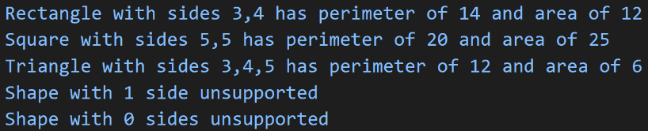

In this project, I was able to create and work with classes, particularly using inheritance. I began by creating three classes: the Shape class, the Rectangle class (which inherits from Shape), and the Triangle class (which also inherits from Shape).

In this project I was provided with more experience in debugging code and gained proficiency in using a generic block of code to process data. In addition I also gained practical experience in writing and executing non-web server Node.js JavaScript code using Visual Studio Code. 

This project enabled me to gain hands-on experience in class creation, inheritance, and implementing specific functionality within each class.

This is what the output of the project: 

